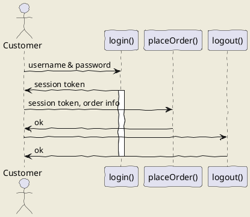

## 試作
- 參考來源
  - https://www.freecodecamp.org/news/inserting-uml-in-markdown-using-vscode/
    - 1. VSCode 中安裝 PlantUML extension
    - 2. 開啟一個 .md 檔，貼上網頁中的範例(如下)，按下 Atrl + D，應該不會出現，因為沒裝 JAVA
    - 3. 裝 JAVA
      - https://nijialin.com/2021/09/10/plantuml-windows/
      - (不用作) 文中的 J2EE 那個我沒作，還是成功使用。
      - 4. 下載 JAVA https://java.com/en/download/
      - 5. 安裝 JAVA，請記得安裝路徑，我是改成 `D:/Programe File/JAVA/jre-1.8`
    - 6. 新增 使用者 環境變數 JAVA_HOME = `D:/Programe File/JAVA/jre-1.8`
    - 7. 登出，重新登入 (我不知道要不要，但我有)
    - 8. 回到 VSCode，此時按 Atl + D 會有結果了，但只有 uml 部分， .md 部分不會存在
      - Alt + D 雖然顯示非全部，但可以匯出圖片，或是在撰寫其中一份時，適合邊寫邊看
    - 9. VSCode 中安裝  Markdown Preview Enhanced extension 、 也裝 Markdown All in One
    - 10. 在 VSCode 中，按下 `Ctrl + ,` 進入設定，並搜尋 `plantumlJarPath` ， 填入 `去 JAVA 官網下載下來的 Complied JAR，你電腦中的路徑`
      - 例如 `D:\coding\plantuml\plantuml-1.2024.3.jar`
    - 11. 在 .md 檔中，按右上角新增的一個 Enhanced 的符號，就可以成功了. 
    - 
## uml: sequence diagram
Here I will embed PlantUML markup to generate a sequence diagram.

I can include as many plantuml segments as I want in my Markdown, and the diagrams can be of any type supported by PlantUML.

