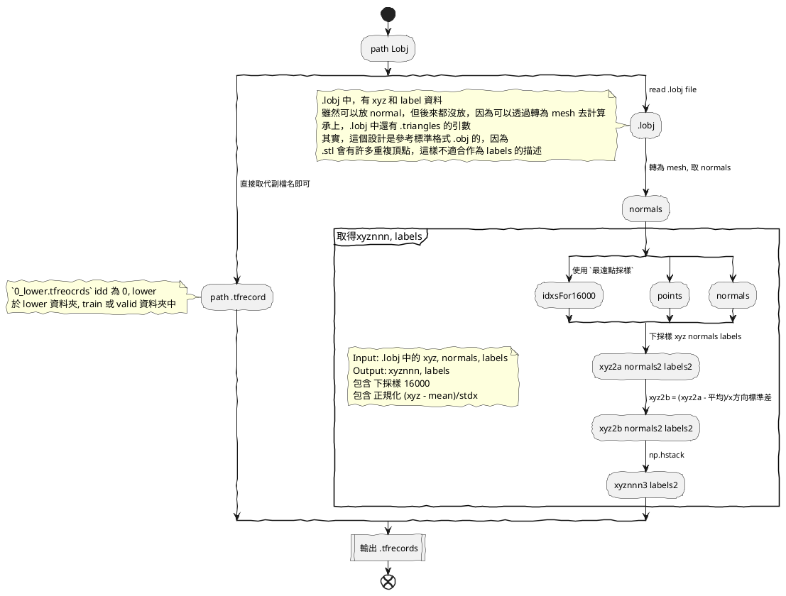
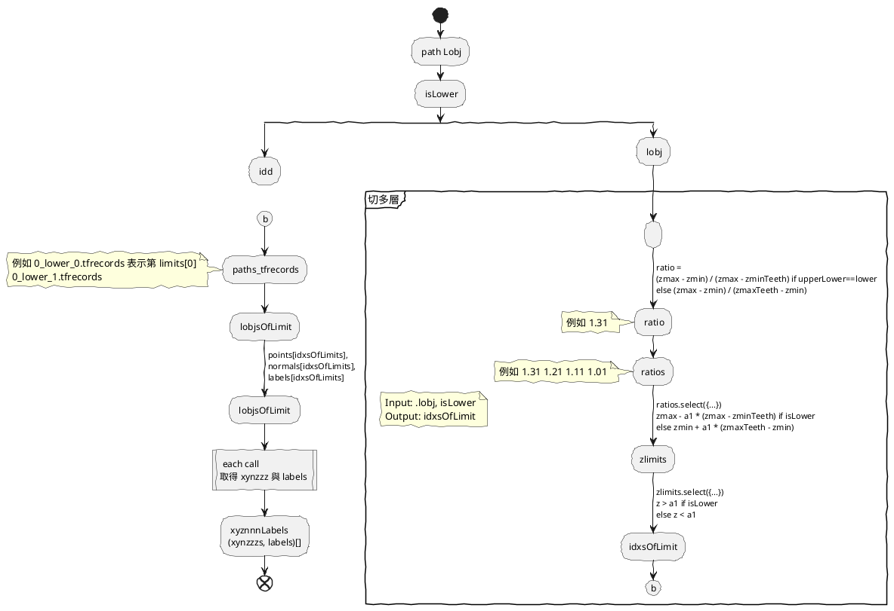
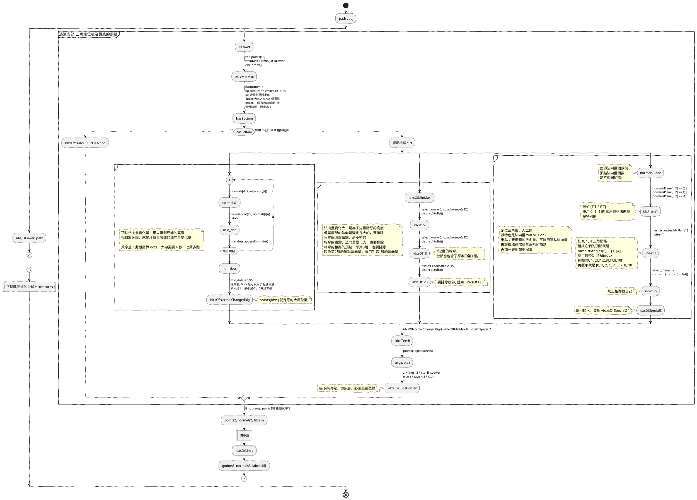
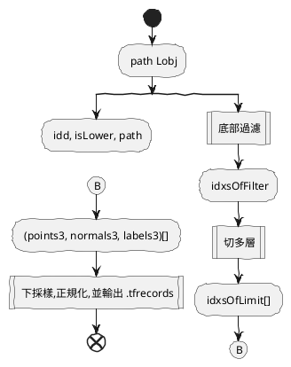

# 流程描述
- input 是 .lobj 檔
- output 是 .tfrecord 檔

## v1早期的輸出

```plantuml
@startuml
skinparam handwritten true
start
: path Lobj;
split
    -> 直接取代副檔名即可;
    : path .tfrecord;
    note
        `0_lower.tfreocrds` idd 為 0, lower
        於 lower 資料夾, train 或 valid 資料夾中
    end note
split again
    -> read .lobj file;
    :.lobj;
    note
        .lobj 中，有 xyz 和 label 資料
        雖然可以放 normal，但後來都沒放，因為可以透過轉為 mesh 去計算
        承上，.lobj 中還有 .triangles 的引數
        其實，這個設計是參考標準格式 .obj 的，因為
        .stl 會有許多重複頂點，這樣不適合作為 labels 的描述
    end note
    -> 轉為 mesh, 取 normals;
    :normals;
    partition "取得xyznnn, labels"{
        note
            Input: .lobj 中的 xyz, normals, labels
            Output: xyznnn, labels
            包含 下採樣 16000 
            包含 正規化 (xyz - mean)/stdx
        end note
        split
            -> 使用 `最遠點採樣`;
            :idxsFor16000;
        split again
            :points;
        split again
            :normals;
        end split
        -> 下採樣 xyz normals labels;
        :xyz2a normals2 labels2;
        -> xyz2b = (xyz2a - 平均)/x方向標準差;
        :xyz2b normals2 labels2;
        -> np.hstack;
        :xyznnn3 labels2;
    }
end split
: 輸出 .tfrecords|
end
@enduml
```

## v2有了底部，一筆多層切割的輸出

```plantuml
@startuml
skinparam handwritten true
start
: path Lobj;
: isLower;
split
    : idd;
    detach
    (b)
    : paths_tfrecords;
    note
        例如 0_lower_0.tfrecords 表示第 limits[0]
        0_lower_1.tfrecords 
    end note
    : lobjsOfLimit;
    -> points[idxsOfLimits], 
    normals[idxsOfLimits], 
    labels[idxsOfLimits];
    : lobjsOfLimit ;
    : each call \n取得 xynzzz 與 labels |
    : xyznnnLabels\n(xynzzzs, labels)[];
    end
split again
    : lobj;
    partition "切多層"{
        note
            Input: .lobj, isLower
            Output: idxsOfLimit
        end note
        :;
        -> ratio = 
        (zmax - zmin) / (zmax - zminTeeth) if upperLower==lower 
        else (zmax - zmin) / (zmaxTeeth - zmin);
        : ratio;
        note: 例如 1.31
        :ratios;
        note: 例如 1.31 1.21 1.11 1.01
        -> ratios.select({...})
        zmax - a1 * (zmax - zminTeeth) if isLower
        else zmin + a1 * (zmaxTeeth - zmin);
        :zlimits;
        -> zlimits.select({...})
        z > a1 if isLower 
        else z < a1 ;
        :idxsOfLimit;
        (b)
        detach
    }
end split
@enduml
```

## v3 有底部,並有角位板
- 有底部的，最下一層可能有不好的 normals
- 底部中間加的，三角形的定位板
  - 特色: 人工加上的，三角網格 normals 方向是固定的。

### 稿1

```plantuml
@startuml
skinparam handwritten true
start
: path Lobj;
split
    : idd, isLower, path;
    (A)
    detach
    (B)
    : 下採樣,正規化,並輸出 .tfrecords|

split again
    partition "過濾底部_三角定位板及最底的頂點"{

        : isLower;
        -> zs = points[:,2]
        zMinMax = z.min() if isLower 
        else z.max();
        : zs, zMinMax;
        -> hasBottom = 
        np.sum( zs == zMinMax ) > 30
        30 這個字是設定的
        有底的大約200-500個頂點
        無底的，所有目前都是1個
        但保險點，設定為30;
        : hasBottom;
        if (hasBottom) then (no)
            : idxsExcludeOutlier = None ;
        else (yes)
            -> 使用 mesh 計算 相鄰資訊;
            : 頂點相鄰 dict;
            split 
                partition {
                    note
                        頂點法向量變化量，用以推測牙齒的高度
                        相對於牙齒，就是牙齦與底部的法向量變化量

                        效率差：此段計算 dots，大約需要 4 秒，七萬多點
                    end note
                    repeat :i;
                        -> normals[dict_adjacency[i]];
                        : normals2 ;
                        -> .select({ dot(a1, normals[i])})
                        : dots ;
                        : min_dot ;
                        -> min_dots.append(min_dot);
                    repeat while (所有頂點 i)
                    : min_dots ;
                    -> min_dots < 0.95
                    經實驗, 0.95 是可以用於有底無底
                    最大是1，最小是-1，0就是90度;
                    : idxsOfNormalChangedBig;
                    note right: points[idxs] 就是牙的大概位置
                    
                }
            split again
                partition {
                    note
                        法向量變化大，是為了先預計牙的高度
                        但是底部的法向量變化是大的，要排除
                        只排除底部頂點，是不夠的
                        相鄰的頂點，法向量變化大，也要排除
                        相鄰的相鄰的頂點，即第3層，也要排除
                        因為第2層的頂點法向量，會用到第1層的法向量
                    end note
                    : idxsOfMinMax ;
                    -> .select_many({dict_adjacency[a1]})
                    .distinct().tolist();
                    : idxsOf2 ;
                    -> .select_many({dict_adjacency[a1]})
                    .distinct().tolist();
                    : idxsOf13;
                    note right: 第2層的相鄰，\n當然也包含了原本的第1層。
                    -> idxsOf13.concat(idxsOf2)
                    .distinct().tolist();
                    : idxsOf123;
                    note right: 要排除底部, 就用 ~idxsOf123
                }
            split again
                partition {
                    note 
                        定位三角形，人工的
                        其特色是法向量 z=0 or 1 or -1
                        重點：要用面的法向量，不能用頂點法向量
                        再取得構成那些三角形的頂點
                        再加一層相鄰更保險
                    end note
                    
                    :normalsPlane;
                    note: 面的法向量個數與\n頂點法向量個數\n是不相同的唷;
                    -> (normalsPlane[:, 2] == 0) | 
                    (normalsPlane[:, 2] == 1) | 
                    (normalsPlane[:, 2] == -1);
                    :idxPlane1;
                    note: 例如 [T T F F T]\n表示 0, 1, 4 的 三角網格法向量 \n是特別的
                    -> mesh.triangles[idxPlane1]
                    .flatten();
                    :index3;
                    note: 如 0, 1, 4 三角網格\n組成它們的頂點就是\nmesh.triangles[0] ... [1] [4] \n就可轉換到 頂點index\n例如[[0, 1, 2],[1,2,3],[7,8,10]]\n再攤平就是 [0, 1, 2, 1, 2, 3, 7, 8, 10]
                    -> .select_many(...)\n.concat(...).distinct().tolist();
                    :index3b;
                    note: 加上相鄰並自己
                    :idxsOfSpecialZ;
                    note: 使用的人，要用 ~idxsOfSpecialZ
                }
            end split
            -> idxsOfNormalChangedBig & ~idxsOfMinMax & ~idxsOfSpecialZ;
            : idxsTeeth;
            -> points[:,2][idxsTeeth];
            : avgz, stdz;
            -> z > (avg - 3 * std) if isLower
            else z < (avg + 3 * std);
            : idxsExcludeOutlier;
            note: 接下來流程，切多層，必須是這些點
        endif
    }
    -> if not none, points2等使用原資料;
    : points2, normals2, labels2;
    : 切多層|
    : idxsOfLimit ;
    : (points3, normals3, labels3)[] ;
    (b)
    detach
end split
end
@enduml
```
### 稿2

```plantuml
@startuml
skinparam handwritten true
start
: path Lobj;
split
    : idd, isLower, path;
    detach
    (B)
    : (points3, normals3, labels3)[] ;
    : 下採樣,正規化,並輸出 .tfrecords|
    end
split again
    : 底部過濾|
    : idxsOfFilter;
    : 切多層|
    : idxsOfLimit[] ;
    (B)
    detach
end split
@enduml
```